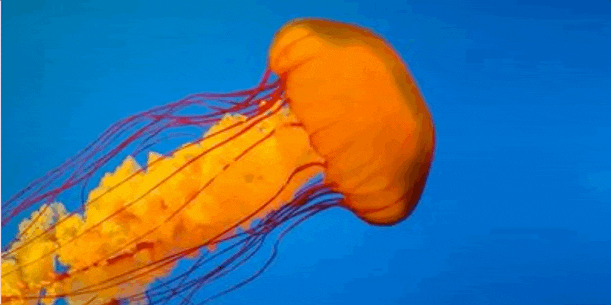

# CSS Paint API: Fragmentation Effect
From my article: https://css-tricks.com/exploring-the-css-paint-api-image-fragmentation-effect/



Create a fragmentation effect with a few lines of code thanks to the CSS Paint API. All you have to do is to apply a mask and adjust some CSS variables.

### [Live Demo](https://afif13.github.io/CSS-fragmentation-effect)

## How to use

First, you include the Paint Worklet you want to use:

```html
<script>
if(CSS.paintWorklet) {              
  CSS.paintWorklet.addModule('src/fragmentation.js');
  //CSS.paintWorklet.addModule('src/fragmentation-triangle.js');
  //CSS.paintWorklet.addModule('src/fragmentation-hexagon.js');
} else {
  console.log("Your browser doesn't support the Paint API :(");
}
</script>
```
The generic CSS will look like below:

```css
@property --f-o{ /* we register this Custom property to be able to animate it */
  syntax: '<number>';
  inherits: false;
  initial-value: 1;
}

img {
  /* you apply the paint() as a mask */
  -webkit-mask:paint(fragmentation);
          mask:paint(fragmentation);
  --f-l:10; /* this will control the fading effect (>1) */
  --f-o:1; /* you animate the variable from 1 .. */
  transition:--f-o 1s;
}
img:hover { 
  --f-o:0; /* .. to 0 to create the fragmentation effect*/
}
```

#### 1. Default Fragmentation

For the default type of fragmentation you need to define the number of rows and columns

```css
img {
  --f-n:10;
  --f-m:20;
}
```

#### 2. Triangle Fragmentation

When using the triangle shapes we only define the number of points that will be used by the [Delaunay triangulation algorithm](https://en.wikipedia.org/wiki/Delaunay_triangulation)

```css
img {
  --f-n:10;
}
```

#### 3. Hexagon Fragmentation

For this one we define the size of the hexagon shape

```css
img {
  --f-r:20;
}
```

-----

Find all the details in my [CSS-tricks article](https://css-tricks.com/exploring-the-css-paint-api-image-fragmentation-effect/)
